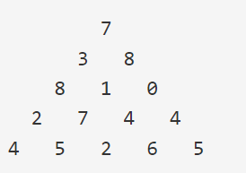

# Class4_02


## 1916 최소비용구하기

### 문제

N개의 도시가 있다. 그리고 한 도시에서 출발하여 다른 도시에 도착하는 M개의 버스가 있다. 우리는 A번째 도시에서 B번째 도시까지 가는데 드는 버스 비용을 최소화 시키려고 한다. A번째 도시에서 B번째 도시까지 가는데 드는 최소비용을 출력하여라. 도시의 번호는 1부터 N까지이다.


### 알고리즘

그냥 다익스트라로 시작 점 넣어서,  도착 점까지 최소비용 출력하면 될듯


```python
import heapq  # 우선순위 큐 구현을 위함
import sys
input=sys.stdin.readline

def dijkstra(graph, start):
    distances = {node: float('inf') for node in graph}
    # start로 부터의 거리 값을 저장하기 위함
    distances[start] = 0  # 시작 값은 0이어야 함
    queue = []
    heapq.heappush(queue, [distances[start], start])
    # 시작 노드부터 탐색 시작 하기 위함.

    while queue:  # queue에 남아 있는 노드가 없으면 끝
        current_distance, current_destination = heapq.heappop(queue)
        # 탐색 할 노드, 거리를 가져옴.

        if distances[current_destination] < current_distance:
            # 기존에 있는 거리보다 길다면, 볼 필요도 없음
            continue

        for new_destination, new_distance in graph[current_destination].items():
            distance = current_distance + new_distance  # 해당 노드를 거쳐 갈 때 거리
            if distance < distances[new_destination]:  # 알고 있는 거리 보다 작으면 갱신
                distances[new_destination] = distance
                heapq.heappush(queue, [distance, new_destination])  # 다음 인접 거리를 계산 하기 위해 큐에 삽입
    return distances

if __name__ == '__main__':
    n=int(input())
    e=int(input())
    edges={ i :{} for i in range(1,n+1)}

    for i in range(e):
        a,b,c=map(int,input().split())
        if b in edges[a]:
            edges[a][b]=min(edges[a][b],c)
        else:
            edges[a][b]=c
            
    start,end=map(int,input().split())
    
    result=dijkstra(edges,start)
    

    print(result[end])
```

 

## 1918 후위표기식

중위표기식으로 표시된 식을 받아 후위표기식으로 표기하는 코드를 작성


### 알고리즘

이거도 약간 암기느낌으로 되어있는데 

문자열 순서대로


- 피연산자가 들어오면 result에 넣고
- 여는 괄호가 들어오면 스택에 일단 넣고
- *, / 가 들어오면 지금까지 스택의 값들을 */ 을만나거나 스택이 끝날떄까지 result에 넣고 스택에 */를 추가
- +,- 가 들어오면 지금까지 스택이 끝나거나 여는 괄호를 만날 떄까지 스택의 값을 result에 넣고 스택에 +-를 추가
- )가 들어오면  스택에서  여는 괄호를 만날 때 까지 스택에서 result에 추가

result 출력


```python
a = input()
stack = [] #스택
res='' #출력

for x in a:
    if x.isalpha(): #피연산자인지 아닌지 확인
        res+=x
    else:
        if x == '(':
            stack.append(x)
        elif x == '*' or x =='/':
            while stack and (stack[-1]=='*' or stack[-1]=='/'):
                res+=stack.pop()
            stack.append(x)
        elif x == '+' or x == '-':
            while stack and stack[-1] != '(':
                res += stack.pop()
            stack.append(x)
        elif x == ')':
            while stack and stack[-1] != '(':
                res+=stack.pop()
            stack.pop()

#스택안에 남아있는 값들 pop            
while stack:
    res += stack.pop()
print(res)
```


## 1932 정수 삼각형

위 그림은 크기가 5인 정수 삼각형의 한 모습이다.

맨 위층 7부터 시작해서 아래에 있는 수 중 하나를 선택하여 아래층으로 내려올 때, 이제까지 선택된 수의 합이 최대가 되는 경로를 구하는 프로그램을 작성하라. 아래층에 있는 수는 현재 층에서 선택된 수의 대각선 왼쪽 또는 대각선 오른쪽에 있는 것 중에서만 선택할 수 있다


### 알고리즘

dp로 맨위에부터 최대값 가져오면서 하면 될듯





```python
import sys
input=sys.stdin.readline

n=int(input())
dp=[[0]*(n+1)for _ in range(n+1)]
for i in range(1,n+1):
    arr=[0]+list(map(int,input().split()))+[0] 
    # 모두 index를 1이상으로 받아서-> 맨 앞칸 index=0칸은 안쓰니까 
    # 맨 뒤에칸은 밑의 층의 가장 우측노드의 위층은 우측노드가 없으니까 
    for j in range(1,i+1):
        dp[i][j]= arr[j]+ max(dp[i-1][j],dp[i-1][j-1]) # 위의 층의 두개중 선택
print(max(dp[n]))


```

